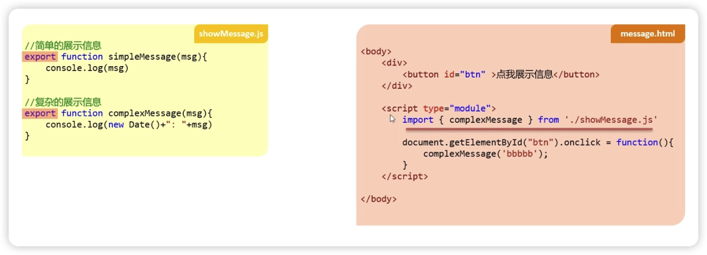
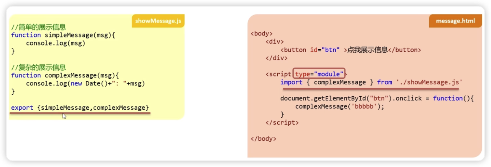
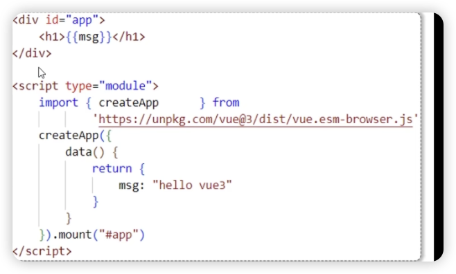
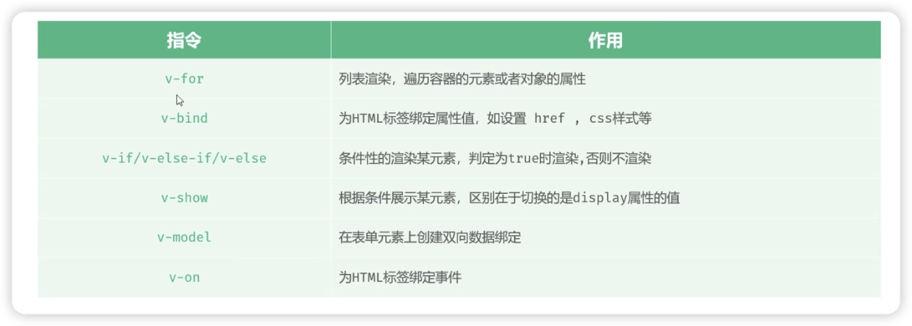
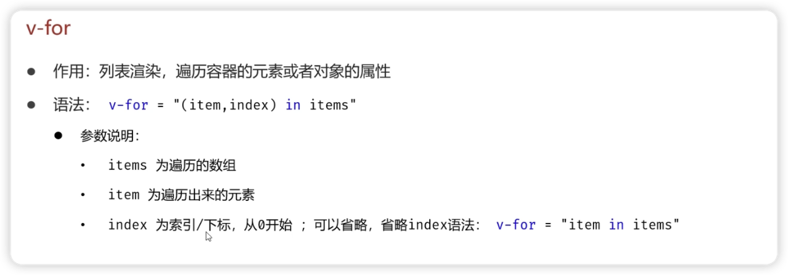
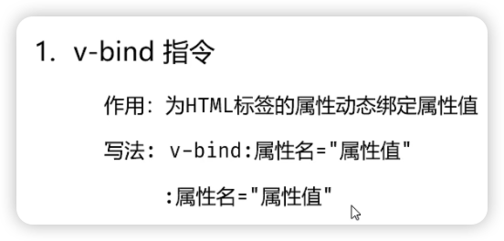

# 1. 安装


https://vuejs.org/guide/quick-start.html

```bash
npm create vue@latest
```

选项

```bash
✔ Project name: … <your-project-name>
✔ Add TypeScript? … No / Yes
✔ Add JSX Support? … No / Yes
✔ Add Vue Router for Single Page Application development? … No / Yes
✔ Add Pinia for state management? … No / Yes
✔ Add Vitest for Unit testing? … No / Yes
✔ Add an End-to-End Testing Solution? … No / Cypress / Nightwatch / Playwright
✔ Add ESLint for code quality? … No / Yes
✔ Add Prettier for code formatting? … No / Yes
✔ Add Vue DevTools 7 extension for debugging? (experimental) … No / Yes

Scaffolding project in ./<your-project-name>...
Done.
```

安装package.json依赖

```bash
cd <your-project-name>
npm install
```

启动服务

```bash
npm run dev
```


# 2. 部署


```dockerfile
# 构建阶段 (builder stage)
FROM node:18 AS builder

# 设置工作目录
WORKDIR /vue

# 复制 package.json 和 package-lock.json (或 yarn.lock)
COPY . .

# 安装依赖
RUN npm install

# 构建项目
RUN npm run build

# 运行阶段 (runner stage)
FROM nginx:alpine

# 删除默认的 html 文件
RUN rm -rf /usr/share/nginx/html/*

# 从 builder 阶段复制构建产物到 Nginx 目录
COPY --from=builder /vue/dist /usr/share/nginx/html

# 复制 Nginx 配置文件 (可选，如果需要自定义 Nginx 配置)
COPY nginx.conf /etc/nginx/conf.d/default.conf

# 暴露 80 端口
EXPOSE 80

# 启动 Nginx
CMD ["nginx", "-g", "daemon off;"]
```

构建镜像

```bash
sudo docker build -t vue .
```

构建容器

```bash
sudo docker run -d --name vuelearn -p 110:110 vue
```

* [ ] 修改nginx配置

# 3. js导入导出





记住script的type选module

# 4. 单文件导入vue



script的type，选module，在填数据数据


# 5. 常用指令



## 5.1 V-for




```xml
<!DOCTYPE html>
<html lang="en">
<head>
    <meta charset="UTF-8">
    <meta name="viewport" content="width=device-width, initial-scale=1.0">
    <title>Document</title>
</head>
<body>

    <div id="app">
        <table border="1 solid" colspa="0" cellspacing="0">
            <tr>
                <th>文章标题</th>
                <th>分类</th>
                <th>发表时间</th>
                <th>状态</th>
                <th>操作</th>
            </tr>
            <!-- 哪个元素要出现多次,v-for指令就添加到哪个元素上 -->
            <tr v-for="(article,index) in articleList">
                <td>{{article.title}}</td>
                <td>{{article.category}}</td>
                <td>{{article.time}}</td>
                <td>{{article.state}}</td>
                <td>
                    <button>编辑</button>
                    <button>删除</button>
                </td>
            </tr>
        
        </table>
    </div>

    <script type="module">
        //导入vue模块
        import { createApp} from 
                'https://unpkg.com/vue@3/dist/vue.esm-browser.js'
        //创建应用实例
        createApp({
            data() {
                return {
                  //定义数据
                    articleList:[{
                                title:"医疗反腐绝非砍医护收入",
                                category:"时事",
                                time:"2023-09-5",
                                state:"已发布"
                            },
                            {
                                title:"中国男篮缘何一败涂地？",
                                category:"篮球",
                                time:"2023-09-5",
                                state:"草稿"
                            },
                            {
                                title:"华山景区已受大风影响阵风达7-8级，未来24小时将持续",
                                category:"旅游",
                                time:"2023-09-5",
                                state:"已发布"
                            }]  
                }
            }
        }).mount("#app")//控制页面元素
        
    </script>
</body>
</html>
```

## 5.2 V-bind



```xml
<!DOCTYPE html>
<html lang="en">
<head>
    <meta charset="UTF-8">
    <meta name="viewport" content="width=device-width, initial-scale=1.0">
    <title>Document</title>
</head>
<body>
    <div id="app">
        <!-- <a v-bind:href="url">黑马官网</a> -->
        <a :href="url">黑马官网</a>
    </div>

    <script type="module">
        //引入vue模块
        import { createApp} from 
                'https://unpkg.com/vue@3/dist/vue.esm-browser.js'
        //创建vue应用实例
        createApp({
            data() {
                return {
                    url: 'https://www.itheima.com'
                }
            }
        }).mount("#app")//控制html元素
    </script>
</body>
</html>
```


```xml
<!DOCTYPE html>
<html lang="en">

<head>
    <meta charset="UTF-8">
    <meta name="viewport" content="width=device-width, initial-scale=1.0">
    <title>Document</title>
</head>

<body>
    <div id="app">

        手链价格为:  <span v-if="customer.level>=0 && customer.level<=1">9.9</span>  
                    <span v-else-if="customer.level>=2 && customer.level<=4">19.9</span> 
                    <span v-else>29.9</span>

        <br/>
        手链价格为:  <span v-show="customer.level>=0 && customer.level<=1">9.9</span>  
                    <span v-show="customer.level>=2 && customer.level<=4">19.9</span> 
                    <span v-show="customer.level>=5">29.9</span>

    </div>

    <script type="module">
        //导入vue模块
        import { createApp} from 'https://unpkg.com/vue@3/dist/vue.esm-browser.js'

        //创建vue应用实例
        createApp({
            data() {
                return {
                    customer:{
                        name:'张三',
                        level:2
                    }
                }
            }
        }).mount("#app")//控制html元素
    </script>
</body>

</html>
```

## 5.3 v-on

```xml
<!DOCTYPE html>
<html lang="en">

<head>
    <meta charset="UTF-8">
    <meta name="viewport" content="width=device-width, initial-scale=1.0">
    <title>Document</title>
</head>

<body>
    <div id="app">

        手链价格为:  <span v-if="customer.level>=0 && customer.level<=1">9.9</span>  
                    <span v-else-if="customer.level>=2 && customer.level<=4">19.9</span> 
                    <span v-else>29.9</span>

        <br/>
        手链价格为:  <span v-show="customer.level>=0 && customer.level<=1">9.9</span>  
                    <span v-show="customer.level>=2 && customer.level<=4">19.9</span> 
                    <span v-show="customer.level>=5">29.9</span>

    </div>

    <script type="module">
        //导入vue模块
        import { createApp} from 'https://unpkg.com/vue@3/dist/vue.esm-browser.js'

        //创建vue应用实例
        createApp({
            data() {
                return {
                    customer:{
                        name:'张三',
                        level:2
                    }
                }
            }
        }).mount("#app")//控制html元素
    </script>
</body>

</html>
```

## 5.4 **指令 v-if\&v-show.html**


这个文件对比了 `v-if` 和 `v-show` 两个指令，它们都用于条件性地显示或隐藏元素。


1. `v-if`、`v-else-if`、`v-else`：这是"真正"的条件渲染，因为它们会确保在切换过程中，条件块内的事件监听器和子组件被适当地销毁和重建。如果初始条件为假，那么元素根本不会被渲染到 DOM 中。

2. `v-show`：这个指令只是简单地切换元素的 CSS `display` 属性。无论初始条件是什么，元素总是会被渲染，只是 display 属性可能为 `none`。


**选择**：


* 如果需要频繁切换，使用 `v-show` 性能更好。

* 如果条件在运行时很少改变，使用 `v-if` 更合适，因为它可以减少初始渲染的开销。


```html
<!DOCTYPE html>
<html lang="en">
  <head>
    <meta charset="UTF-8" />
    <meta name="viewport" content="width=device-width, initial-scale=1.0" />
    <title>Document</title>
  </head>

  <body>
    <div id="app">
      手链价格为: <span v-if="customer.level>=0 && customer.level<=1">9.9</span>
      <span v-else-if="customer.level>=2 && customer.level<=4">19.9</span>
      <span v-else>29.9</span>

      <br />
      手链价格为:
      <span v-show="customer.level>=0 && customer.level<=1">9.9</span>
      <span v-show="customer.level>=2 && customer.level<=4">19.9</span>
      <span v-show="customer.level>=5">29.9</span>
    </div>

    <script type="module">
      //导入vue模块
      import { createApp } from "https://unpkg.com/vue@3/dist/vue.esm-browser.js";

      //创建vue应用实例
      createApp({
        data() {
          return {
            customer: {
              name: "张三",
              level: 2,
            },
          };
        },
      }).mount("#app"); //控制html元素
    </script>
  </body>
</html>
```


## **5. 05 指令 v-on.html**


这个文件演示了 `v-on` 指令，它用于监听 DOM 事件，并在事件触发时执行一些 JavaScript 代码。

`v-on:click="money"` 表示当用户点击这个按钮时，会调用 Vue 实例中 `methods` 对象里的 `money` 方法。

`methods` 选项用于存放所有事件处理函数或业务逻辑方法。

`v-on:` 同样有一个常用的简写形式，即 `@` 符号，所以 `@click="love"` 和 `v-on:click="love"` 是等效的。


```html
<!DOCTYPE html>
<html lang="en">
  <head>
    <meta charset="UTF-8" />
    <meta name="viewport" content="width=device-width, initial-scale=1.0" />
    <title>Document</title>
  </head>
  <body>
    <div id="app">
      <button v-on:click="money">点我有惊喜</button> &nbsp;
      <button @click="love">再点更惊喜</button>
    </div>

    <script type="module">
      //导入vue模块
      import { createApp } from "https://unpkg.com/vue@3/dist/vue.esm-browser.js";

      //创建vue应用实例
      createApp({
        data() {
          return {
            //定义数据
          };
        },
        methods: {
          money: function () {
            alert("送你钱100");
          },
          love: function () {
            alert("爱你一万年");
          },
        },
      }).mount("#app"); //控制html元素
    </script>
  </body>
</html>
```


## **6. 06 指令 v-model.html**


这个文件展示了 `v-model` 指令的强大功能，它用于在表单的 `<input>`, `<textarea>`, 及 `<select>` 元素上创建双向数据绑定。

`v-model="searchConditions.category"` 将输入框的值与 `data` 中的 `searchConditions.category` 属性绑定。

这意味着：

这个例子还演示了 `methods` 中的方法（如 `clear`) 如何修改数据，以及 `mounted` 生命周期钩子的使用，它常用于在组件挂载到 DOM 后执行初始化操作（如从服务器获取数据）。


```html
<!DOCTYPE html>
<html lang="en">
  <head>
    <meta charset="UTF-8" />
    <meta name="viewport" content="width=device-width, initial-scale=1.0" />
    <title>Document</title>
  </head>

  <body>
    <div id="app">
      文章分类: <input type="text" v-model="searchConditions.category" />
      <span>{{searchConditions.category}}</span>

      发布状态: <input type="text" v-model="searchConditions.state" />
      <span>{{searchConditions.state}}</span>

      <button>搜索</button>
      <button v-on:click="clear">重置</button>

      <br />
      <br />
      <table border="1 solid" colspa="0" cellspacing="0">
        <tr>
          <th>文章标题</th>
          <th>分类</th>
          <th>发表时间</th>
          <th>状态</th>
          <th>操作</th>
        </tr>
        <tr v-for="(article,index) in articleList">
          <td>{{article.title}}</td>
          <td>{{article.category}}</td>
          <td>{{article.time}}</td>
          <td>{{article.state}}</td>
          <td>
            <button>编辑</button>
            <button>删除</button>
          </td>
        </tr>
      </table>
    </div>
    <script type="module">
      //导入vue模块
      import { createApp } from "https://unpkg.com/vue@3/dist/vue.esm-browser.js";
      //创建vue应用实例
      createApp({
        data() {
          return {
            //定义数据
            searchConditions: {
              category: "",
              state: "",
            },

            articleList: [
              {
                title: "医疗反腐绝非砍医护收入",
                category: "时事",
                time: "2023-09-5",
                state: "已发布",
              },
              {
                title: "中国男篮缘何一败涂地？",
                category: "篮球",
                time: "2023-09-5",
                state: "草稿",
              },
              {
                title: "华山景区已受大风影响阵风达7-8级，未来24小时将持续",
                category: "旅游",
                time: "2023-09-5",
                state: "已发布",
              },
            ],
          };
        },
        methods: {
          clear: function () {
            //清空category以及state的数据
            //在methods对应的方法里面,使用this就代表的是vue实例,可以使用this获取到vue实例中准备的数据
            this.searchConditions.category = "";
            this.searchConditions.state = "";
          },
        },
        mounted: function () {
          console.log("Vue挂载完毕,发送请求获取数据");
        },
      }).mount("#app"); //控制html元素
    </script>
  </body>
</html>
```


## **7. 07axios 使用.html**


这个文件独立于 Vue，演示了如何使用 `axios` 库来发送 HTTP 请求。在现代前端开发中，与后端服务器进行数据交互是必不可少的环节。


1. 首先通过 `<script>` 标签引入 `axios` 库。

2. 代码中展示了如何使用 `axios.post` 方法发送一个 POST 请求，并携带一个 `article` 对象作为请求体。

3. `.then()` 方法用于处理请求成功后的回调，`result.data` 通常包含了服务器返回的核心数据。

4. `.catch()` 方法用于捕获和处理请求过程中发生的错误。

5. 文件中还注释掉了 GET 请求和另一种 POST 写法的示例。


```html
<!DOCTYPE html>
<html lang="en">
  <head>
    <meta charset="UTF-8" />
    <meta name="viewport" content="width=device-width, initial-scale=1.0" />
    <title>Document</title>
  </head>

  <body>
    <!-- 引入axios的js文件 -->
    <script src="https://unpkg.com/axios/dist/axios.min.js"></script>
    <script>
      /* 发送请求 */
      /* axios({
            method:'get',
            url:'http://localhost:8080/article/getAll'
        }).then(result=>{
            //成功的回调
            //result代表服务器响应的所有的数据,包含了响应头,响应体. result.data 代表的是接口响应的核心数据
            console.log(result.data);
        }).catch(err=>{
            //失败的回调
            console.log(err);
        }); */
      let article = {
        title: "明天会更好",
        category: "生活",
        time: "2000-01-01",
        state: "草稿",
      };
      /*  axios({
             method:'post',
             url:'http://localhost:8080/article/add',
             data:article
         }).then(result=>{
             //成功的回调
             //result代表服务器响应的所有的数据,包含了响应头,响应体. result.data 代表的是接口响应的核心数据
             console.log(result.data);
         }).catch(err=>{
             //失败的回调
             console.log(err);
         }); */

      //别名的方式发送请求
      /* axios.get('http://localhost:8080/article/getAll').then(result => {
            //成功的回调
            //result代表服务器响应的所有的数据,包含了响应头,响应体. result.data 代表的是接口响应的核心数据
            console.log(result.data);
        }).catch(err => {
            //失败的回调
            console.log(err);
        }); */
      axios
        .post("http://localhost:8080/article/add", article)
        .then((result) => {
          //成功的回调
          //result代表服务器响应的所有的数据,包含了响应头,响应体. result.data 代表的是接口响应的核心数据
          console.log(result.data);
        })
        .catch((err) => {
          //失败的回调
          console.log(err);
        });
    </script>
  </body>
</html>
```

